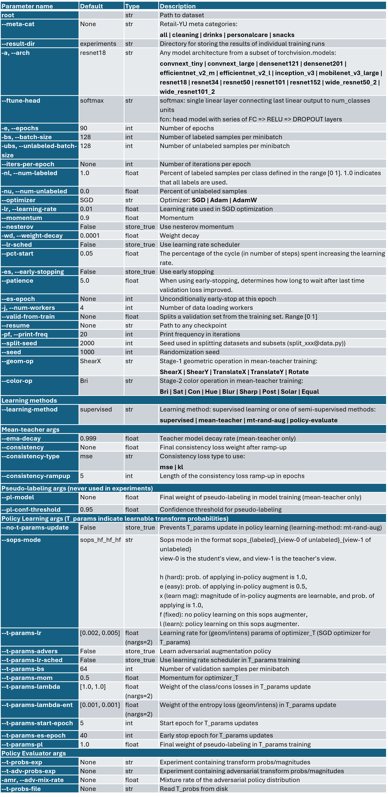
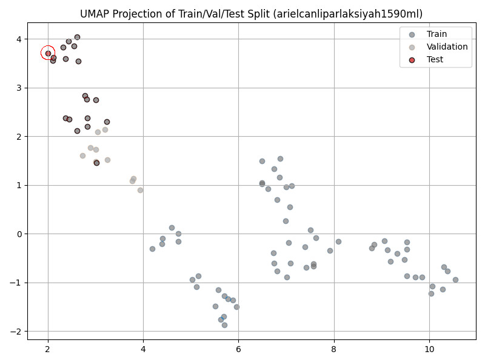
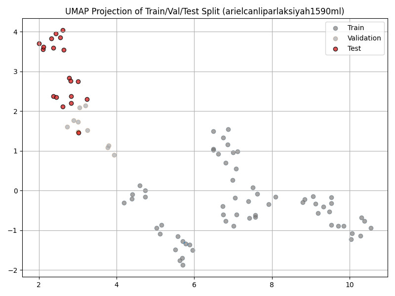
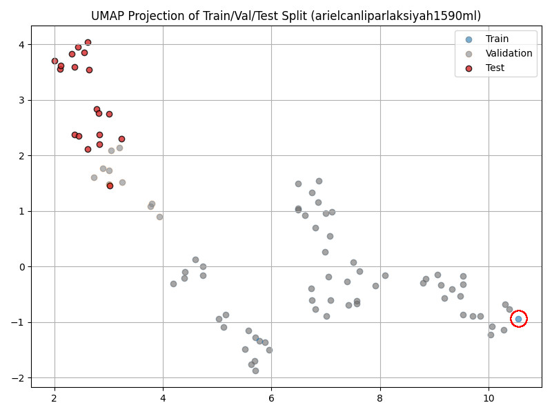
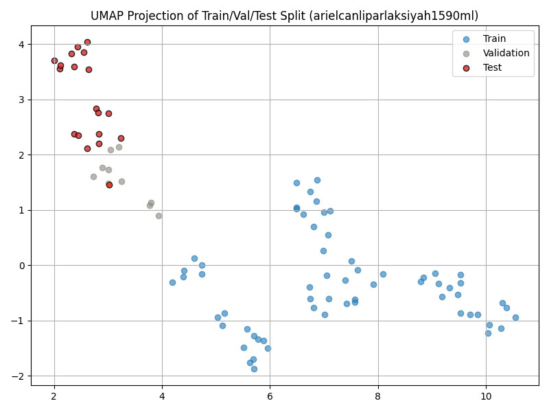
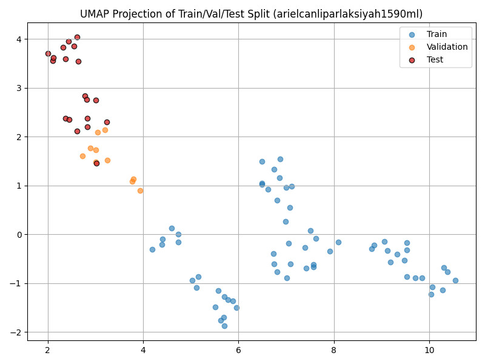

# Tiny-RandAugment: An Efficient and Automatic Data Augmentation Pipeline for Semi-Supervised Learning

You can access data related to this paper on [Mendeley Data](https://data.mendeley.com/drafts/z6jdbh25gv).

## Table of Contents

- [Script Parameters](#script-parameters)
- [--sops-mode parameter](#--sops-mode-parameter)
- [Script Parameter Permutations](#script-parameter-permutations)
- [Distance-aware split of Retail-YU dataset](#distance-aware-split-of-retail-yu-dataset)
- [Section 4.1.1: Mean-teacher Performance of Two-stage Policies](#section-411-mean-teacher-performance-of-two-stage-policies)
- [Section 4.1.2: Mixing Learned Policies with Adversarial and Random Policies](#section-412-mixing-learned-policies-with-adversarial-and-random-policies)
- [Section 4.2.3: Baseline: Tiny-RA without Policy Learning](#section-423-baseline-tiny-ra-without-policy-learning)
- [Section 4.2.4: Tiny-RA with Policy Learning](#section-424tiny-ra-with-policy-learning)

## Script Parameters

Positional (first) script parameter, `root`, serves two functions depending on whether `meta-cat` is defined. If `meta-cat` is not defined, `root` represents the `path to dataset` (for example `data/CIFAR10`). If `meta-cat` is defined, dataset is Retail-YU, and path to meta-category dataset is formed in the following way: `{retail_yu_root}/{meta_cat}/shelf/{root}`. `retail_yu_root` is defined in `trainer_base.py` and should be set before using the script. In this context `root` represents a specific split of the meta-category data. Distance-aware split (DAS) used in this study is discussed in the following section. It is coded as `resnet50-das.42`. For example, distance-aware split of the cleaning meta-category is defined by positional `root` and `meta-cat`: `python train.py resnet50-das.42 --meta-cat cleaning ...`

<p align="center">
  
</p>

## `--sops-mode` parameter

As described in Section 4.2.4, “Tiny-RA with Policy Learning,” Tiny-RA can be used at three different positions in the training pipeline, denoted as `aug_lbl`, `aug_stu`, and `aug_tea`. As pointed the paper, policy learning is applied to `aug_lbl` and `aug_tea`, but not to `aug_stu`. Although the results reported in the paper are based on this configuration, the training script provides more flexibility.

The `--sops-mode` parameter specifies whether Tiny-RA is fixed or learned at each position and also controls its strength using two settings: *easy* and *hard*. Here, **SOPS** refers to “single operation per sample,” another naming for Tiny_RA which emphasizes that a different operation is applied to each sample. The `--sops-mode` argument follows the format `sops_{aug_lbl_mode}_{aug_stu_mode}_{aug_tea_mode}`. Each mode is represented by two letters. The first letter indicates the strength of Tiny-RA: ‘e’ denotes *easy*, in which the selected operation is applied with a probability of 50%, whereas ‘h’ denotes *hard*, in which the selected operation is always applied. The second letter indicates whether the policy is fixed or learned: ‘f’ denotes a fixed policy without policy learning, while ‘l’ denotes a learned policy.

Based on our experiments and following the weak/strong augmentation distinction used in UDA and FixMatch, we used *easy* mode for `aug_lbl` and `aug_tea` when evaluating the learned policies. However, during policy learning, we used *hard* mode at these positions to obtain more consistent gradient updates for the operator probabilities. Accordingly, the `--sops-mode` configuration was set to `sops_hl_hf_hl` during policy learning and to `sops_ef_hf_ef` during policy evaluation. In addition, in Section 4.2.3, “Baseline: Tiny-RA without Policy Learning,” where Tiny-RA was used without policy learning, the `--sops-mode` configuration was also set to `sops_ef_hf_ef`.

## Script Parameter Permutations

We use Onager[^1], a tool for sending batch of jobs to TRUBA[^2]. Onager creates SLURM commands for permutations of script parameters through its `+arg` parameter. It is commonly used for hyperparameter search, but in our study, we mostly used it for getting average accuracy over some parameters. For example, to create supervised training commands for parameters (1) 20%, 10% and 5% of the labels used, (2) each meta-category of Retail-YU dataset and (3) seeds 1000-1004, call `prelaunch` subcommand of Onager as follows:

```bash
onager prelaunch +jobname sv_lbl_rat +command "python train.py resnet50-das.42 --result-dir temp \
--arch resnet34 -e 90 -bs 64 -lr 0.01 --lr-sched --optimizer SGD --learning-method supervised" \
+arg --num-labeled 0.2 0.1 0.05 +arg --meta-cat cleaning drinks personalcare snacks +arg --seed {1000..1004}
```

This command creates 3x4x5=60 jobs where each of them runs the training script for one
combination of `--num-labeled`, `--meta-cat`, and `--seed`. To run the jobs, call the `launch` subcommand.

```bash
onager launch --backend slurm --jobname sv_lbl_rat --duration 05:00:00 -p barbun-cuda -c 20 --gres=gpu:1
```

This will send following 60 jobs to the requested queue. `***` is a placeholder for the constant parameters.

```bash
python train.py resnet50-das.42 *** --num-labeled 0.2 --meta-cat cleaning --seed 1000
...
python train.py resnet50-das.42 *** --num-labeled 0.2 --meta-cat cleaning --seed 1004
python train.py resnet50-das.42 *** --num-labeled 0.2 --meta-cat personalcare --seed 1000
...
python train.py resnet50-das.42 *** --num-labeled 0.2 --meta-cat snacks --seed 1004
python train.py resnet50-das.42 *** --num-labeled 0.1 --meta-cat cleaning --seed 1000
...
python train.py resnet50-das.42 *** --num-labeled 0.05 --meta-cat snacks --seed 1004
```

## Distance-aware split of [Retail-YU](https://data.mendeley.com/datasets/mmcf24t9vv) dataset

The Retail-YU dataset contains many visually similar images within each class. When these images are randomly assigned to the training, validation, and test sets, the resulting distributions may substantially overlap. In our experiments, we observed that deep models could achieve very high accuracy with only a small number of labeled samples under such a random split. To create a more challenging evaluation setting and increase the distribution shift between the training, validation, and test sets, we applied a distance-aware splitting strategy.

First, features were extracted for all samples using a pre-trained ResNet-50 model and stored. These feature vectors were then reduced to 10 dimensions using UMAP. For each class, the following procedure was applied:

1)  The centroid of the 10-D feature representations of all in-class samples was computed.

2)  The sample farthest from this centroid was selected as the first test sample.

3)  According to the predefined split ratio, the remaining test samples were selected from the samples closest to this initial test sample. This formed the test set.

4)  The sample farthest from the selected test samples was then chosen as the first training sample.

5)  Again, according to the split ratio, the remaining training samples were selected from the samples closest to this initial training sample. This formed the training set.

6)  The remaining samples were assigned to the validation set.

This procedure was repeated independently for each class. Since the split was generated using ResNet-50 features with a random seed of 42, we refer to this split as `resnet50-das.42`.

You can download `resnet50-das.42` from [Mendeley Data](https://data.mendeley.com/drafts/z6jdbh25gv).

<p align="center">
  
</p>

<p align="center"><em>Figure 1. Step (2) The sample farthest from the cluster centroid is selected as the first test sample</em></p>

<p align="center">
  
</p>

<p align="center"><em>Figure 2. Step (3): Test samples are selected from the samples closest to the initial test sample.</em></p>

<p align="center">
  
</p>

<p align="center"><em>Figure 3. Step (4): The sample farthest from the test samples is then chosen as the first training sample.</em></p>

<p align="center">
  
</p>

<p align="center"><em>Figure 4. Step (5): The remaining training samples are selected from the samples closest to this initial training sample.</em></p>

<p align="center">
  
</p>

<p align="center"><em>Figure 5. Step (6): The remaining samples are assigned to the validation set</em></p>

## Section 4.1.1: Mean-teacher Performance of Two-stage Policies

**Table 4.** Individual policies ranked by average accuracy of the ResNET-34 model over 3 training runs with the setting {learning method: mean-teacher, augmenter: 2-stage policies, data: snacks (10%)}.

Onager command for seed 1000:

```bash
onager prelaunch +jobname mt_hard_1000 resnet50-das.42 --result-dir mt_search_hard_ops/1000 \
--arch resnet34 --learning-method mean-teacher -e 75 -bs 16 --ubs 64 -lr 0.01 --lr-sched \
--optimizer SGD --ema-decay 0.99 --consistency-type mse --consistency 500 --consistency-rampup 10 \
--seed 1000 --num-workers 8 --num-labels 0.1 --meta-cat snacks +arg --color-op Bri Sat Con Hue Blur Sharp Post Solar Equal \
+arg --geom-op ShearX ShearY TranslateX TranslateY Rotate
```

- 3 onager sessions over `--seed={1000,1001,1002}`

- Permutation sets at each session: `--color-op` = ["Bri", "Sat", "Con", "Hue", "Blur", "Sharp", "Post", "Solar", "Equal"], `--geom-op` = ["ShearX", "ShearY", "TranslateX", "TranslateY", "Rotate"]

- **Aggregate Results:** Mean-teacher trainings (`--learning-method mean-teacher`) left a file in the run folder marking the `color-op` and the `geom-op` of the run: `f"T_{geom-op}_{color-op}"`. `evaluate.py` scraps the operators from this file name. Call it in the following way to aggregate results in a single CSV file.

```bash
python evaluate.py mt_search_hard_ops/1000 --exps 0..44 --get-results val
```

## Section 4.1.2: Mixing Learned Policies with Adversarial and Random Policies

**Figure 11.** Geometric and color operator distributions for min- and max-loss policies.

**Figure 11 (a)** Min-loss Policy

```bash
python train.py cifar10 --result-dir policy_learn --arch resnet18 --ftune-head fcn \
--learning-method mt-rand-aug -e 75 -bs 64 --optimizer SGD -lr 1e-2 --lr-sched -es --es-epoch 30 \
--t-params-start-epoch 5 --t-params-es-epoch 25 --t-params-lr 2e-3 5e-3 --t-params-bs 32 \
--t-params-mom 0.9 --t-params-lambda 1. 5. --t-params-lambda-ent .1 .0 --num-workers 8 \
--num-labeled 0.2 --seed 1000 --sops-mode sops_hl_hf_hf --iters-per-epoch 157
```

**Figure 11 (b)** Max-loss Policy

```bash
python train.py *** --t-params-advers
```

- Single training run for both figures. Runs create  `000-`and `001-` experiments under `policy_learn` folder. Policy learning stops at epoch 25 (`--t-params-es-epoch 25`). Only *class_geom_probs.csv* and *class_intens_probs.csv* are updated as `--consistency` takes default `None` value (when not defined). `cons_***_probs.csv` files are irrelavent as `--consistency` is not defined.

- Since the policy is trained only using the classification loss in this experiment, `--sops-mode` is set to `sops_hl_hf_hf`.

- *** holds overlapping parts to Figure 11(a) command. `--t-params-advers` of Figure 11(b) turns on the maximum loss objective.

- A slight entropy regularization on parameters of geom. operations as their distribution can become rapidly peaked in some configurations (`--t-params-lambda-ent`).

**Figure 13.** Test set accuracy of policy mixtures on CIFAR-10.

**Figure 13 (a)** Min-/max-loss Policy Mixture

Onager command for mixture rate (-amr) 0.0:
```bash
onager prelaunch +jobname amr_0r +command "python train.py cifar10 --result-dir amr_cifar10/0r --arch resnet34 \
--ftune-head fcn --learning-method policy-evaluate -e 75 -bs 64 --optimizer SGD -lr 1e-2 --lr-sched -es --patience 1.2 \
--consistency 0 --num-workers 8 -nl 0.2 --sops-mode sops_hf_hf_hf --iters-per-epoch 157 \
--t-probs-exp policy_learn/000 --t-adv-probs-exp policy_learn/001 -amr 0.0" +arg --seed {1000..1006}
```

**Figure 13 (b)** Min-loss/Random Policy Mixture

Onager command for mixture rate (-amr) 0.2:
```bash
onager prelaunch +jobname rmr_20r +command "python train.py cifar10 --result-dir rmr_cifar10/20r \
*** --t-probs-exp policy_learn/000 --t-adv-probs-exp policy_learn/002 -amr 0.2" +arg --seed {1000..1006}
```

- 6 onager sessions over `-amr={0.0,0.2,0.4,0.6,0.8,1.0}` leading to experiment subfolders formatted as `f"{amr * 100}r"`. Policy-mixing evaluated at some intermediate values for Figure 13(b): `-amr={0.25,0.5,0.75}`.

- *** holds overlapping parts to Figure 13(a) command. `--t-probs-exp` and `--t-adv-probs-exp` refers to learned policies from Figure 11's trainings. In Figure 13(b), `--t-adv-probs-exp` refers to uniform distribution (`policy_learn/002-randaug-cifar10`)

- We observed stable "U-shaped validation loss" pattern in supervised training on CIFAR10. Hence we turned on early-stopping (`-es`) in these experiments.

- For faster experimentation, training was conducted on a 20% split of CIFAR-10 (`-nl 0.2`).

- **Aggregate Results:** For example, for amr=0.4, call the following command.

```bash
python evaluate.py rmr_cifar10/40r --exps 0..9 --get-results val --best-from-avg
```

## Section 4.2.3: Baseline: Tiny-RA without Policy Learning

**Figure 14.** Average mean-teacher accuracy of Tiny-RA (no-learn) for each meta-category of Retail-YU and for labeled data ratios of 10%, 5% and 1%.

Onager command for labeled data ration 10% (`-nl 0.1`):
```bash
onager prelaunch +jobname sops_ef_hf_ef_10p +command "python train.py resnet50-das.42 \
--result-dir sops_ef_hf_ef/10p --arch resnet34 --learning-method mt-rand-aug -e 75 -bs 16 -ubs 64 \
--optimizer SGD -lr 1e-2 --lr-sched --ema-decay 0.99 --consistency-type mse --consistency 500 \
--consistency-rampup 10 --sops-mode sops_ef_hf_ef --no-t-params-update --num-workers 8 -nl 0.1" \
+arg --meta-cat cleaning drinks personalcare snacks +arg --seed {1000..1009}
```

- 3 onager sessions over `-nl={0.1,0.05,0.01}` leading to experiment subfolders 10p, 5p and 1p.

- `--no-t-params-update` ensures that the operator probabilities remain constant (and equal) throughout training.

- **Aggregate Results:** Collect results into a single .csv under each subfolder 10p, 5p and 1p.

```bash
python evaluate.py sops_ef_hf_ef/10p --exps 0..40 --get-results val --output-csv sops_ef_hf_ef_10p.csv
```

## Section 4.2.4:	Tiny-RA with Policy Learning

**Figure 16. and Figure 18.** Geometric and color operator distributions for classification-path and consistency-path OSMs.

Onager command:
```bash
onager prelaunch +jobname retailyu_pl +command "python resnet50-das.42 --result-dir policy_learn --arch resnet18 \
--learning-method mt-rand-aug -e 75 -bs 16 -ubs 64 --optimizer SGD -lr 1e-2 --lr-sched -es --es-epoch 30 \
--ema-decay 0.99 --consistency-type mse --consistency 500 --consistency-rampup 10 --t-params-start-epoch 5 \
--t-params-es-epoch 25 --t-params-lr 2e-3 5e-3 --t-params-bs 32 --t-params-mom 0.9 --t-params-pl 1.0 \
--t-params-lambda-ent .0 .0 --num-workers 8 -nl 0.1 -nu 0.9 --seed 1000 --sops-mode sops_hl_hf_hl" \
+arg --meta-cat cleaning drinks personalcare snacks
```

- Single onager session (above command) for meta-categories of Retail-YU.

**Figure 19.** Test accuracy of policy-mixing for each meta-category, labeled data ratio (10%, 5% and 1%), and mixing factor (α).

Onager command for mixture rate 0.4 (`-amr 0.4`):
```bash
onager prelaunch +jobname rmr_40r +command "python train.py resnet50-das.42 --result-dir rmr/40r \
--arch resnet34 --learning-method policy-evaluate -e 120 -bs 16 -ubs 64 --optimizer SGD -lr 1e-2 --lr-sched \
--ema-decay 0.99 --consistency-type mse --consistency 500 --consistency-rampup 10 --no-t-params-update \
--num-workers 8 --sops-mode sops_ef_hf_ef --t-adv-probs-exp policy_learn/003 -amr 0.4 --iters-per-epoch 200" \
+arg --meta-cat "cleaning --t-probs-exp policy_learn/009" "drinks --t-probs-exp policy_learn/008" \
"personalcare --t-probs-exp policy_learn/010" "snacks --t-probs-exp policy_learn/004" \
+arg -nl "0.1 -nu 0.9" "0.05 -nu 0.95" "0.01 -nu 0.99" +arg --seed {1000..1006}
```

- 6 onager sessions over `-amr={0.0,0.2,0.4,0.6,0.8,1.0}`.

- In our enviroment, augmentation policies related to “cleaning,” “drinks,” “personal care,” and “snacks” meta-categories are experiments 008, 009, 010, and 004, respectively, located in the `policy_learn` folder. These should be replaced with the appropriate experiment numbers in a new environment.

[^1]: Onager (https://github.com/camall3n/onager)

[^2]: Turkish National e-Science e-Infrastructure (<https://www.truba.gov.tr>)
